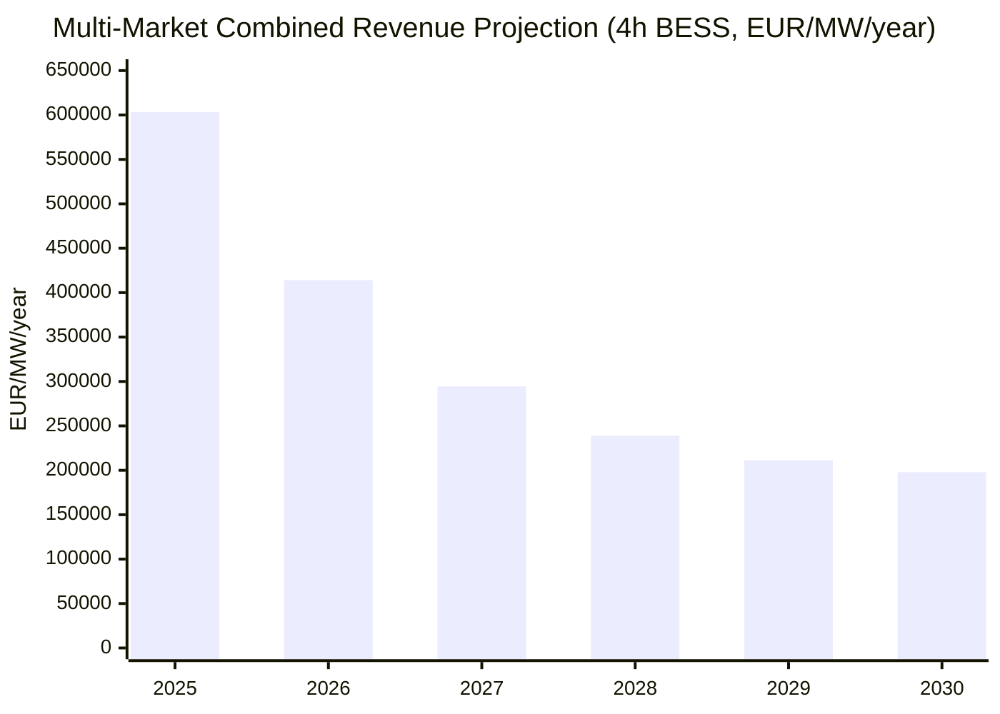
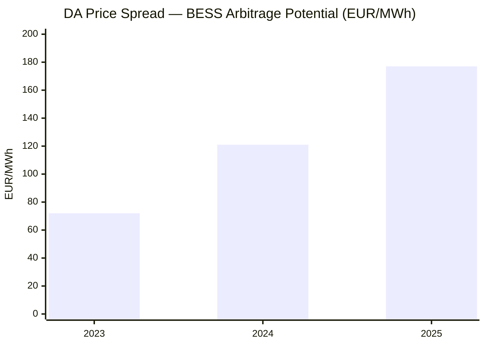
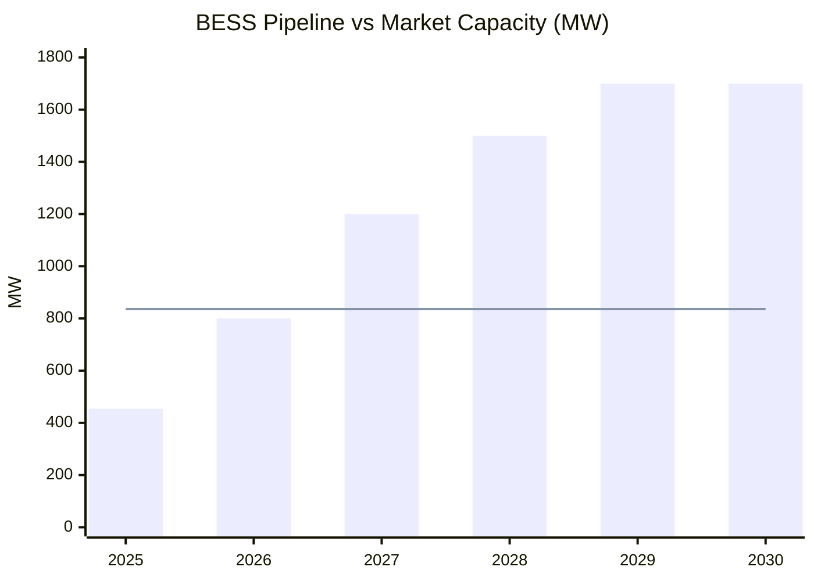
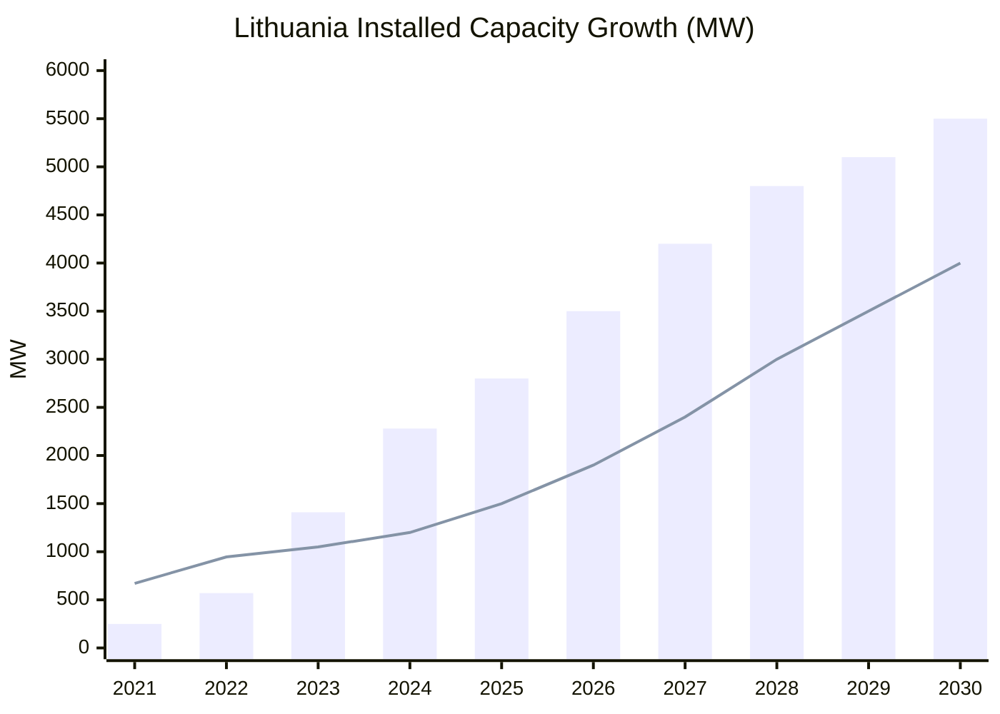

# Lithuania BESS Market Analysis

Comprehensive Battery Energy Storage System (BESS) investment analysis for the Lithuanian electricity market, covering revenue modeling, market dynamics, and saturation assessment.

## Key Findings

| Metric | Value |
|--------|-------|
| **2025 Multi-Market Revenue (4h BESS)** | ~578,000 EUR/MW/year |
| **2030 Projected (with saturation)** | ~198,000 EUR/MW/year |
| **BESS Installed (2025)** | 454 MW / 462 MWh |
| **BESS Pipeline** | 1.7 GW / 4.0 GWh pipeline (50+ applications) |
| **aFRR Requirement** | ~410 MW (2025 actual) |
| **DA Daily Price Spread** | EUR 177 mean (2025) |

## Context

Lithuania disconnected from the Russian BRELL grid on February 8-9, 2025 and synchronized with Continental Europe. This created:
- Extreme scarcity in balancing reserves (aFRR Up prices jumped from EUR 0.87 to EUR 29.56 mean per 15-min period)
- FCR market launch with EUR 145/MW/h clearing on day one
- Frequency reserve price spikes from EUR 9,976 to -EUR 4,473/MWh
- 65-71% electricity price increases during Estlink 2 cable failure

These conditions make Lithuania one of Europe's most attractive BESS markets in 2025, but revenue compression is expected as 1.7 GW of pipeline capacity enters the market.

---

## BESS Revenue by Market Segment (2025 Actual)

Revenue computed from actual ENTSO-E data. All figures in **EUR/MW/year**.

| Revenue Stream | 1h BESS | 2h BESS | 4h BESS |
|----------------|--------:|--------:|--------:|
| DA Arbitrage | 50,613 | 93,466 | 163,707 |
| aFRR | 545,467 | 671,344 | 755,262 |
| FCR | 216,810 | 221,628 | 228,855 |
| mFRR | 2,037,634 | 2,386,943 | 2,619,815 |
| Imbalance | 0 | 0 | 0 |
| **Multi-Market Combined** | **544,284** | **556,887** | **577,546** |

> **Note:** Individual market revenues represent theoretical maximums if 100% of time is allocated to that market. Multi-Market Combined uses realistic time allocation: aFRR 40%, FCR 20%, DA 25%, mFRR 5%, Imbalance 10%.

### Revenue Comparison: 2024 (Pre-Desynchronization)

| Revenue Stream | 1h BESS | 2h BESS | 4h BESS |
|----------------|--------:|--------:|--------:|
| DA Arbitrage | 42,973 | 78,611 | 132,199 |
| aFRR | 9,907 | 12,194 | 13,718 |
| FCR | 0 | 0 | 0 |
| mFRR | 428,823 | 502,335 | 551,344 |
| **Multi-Market Combined** | **57,480** | **74,680** | **101,288** |

> aFRR revenues increased **55x** from 2024 to 2025 post-BRELL disconnection. FCR market didn't exist before Feb 2025.

## Revenue Projection 2025-2030

Forward projections with BESS market saturation effects:

| Year | 1h BESS | 2h BESS | 4h BESS | Compression | BESS Installed |
|------|--------:|--------:|--------:|:-----------:|---------------:|
| 2025 | 552,397 | 571,719 | 603,225 | 100% | 454 MW |
| 2026 | 370,885 | 387,309 | 414,089 | 65% | 700 MW |
| 2027 | 258,928 | 272,453 | 294,507 | 45% | 1,200 MW |
| 2028 | 208,506 | 220,099 | 239,003 | 35% | 1,500 MW |
| 2029 | 183,295 | 193,922 | 211,250 | 30% | 1,800 MW |
| 2030 | 172,521 | 182,182 | 197,935 | 28% | 2,000 MW |



---

## Day-Ahead Price Analysis

Annual DA price summary from ENTSO-E data (EUR/MWh):

| Year | Avg | Min | Max | Std Dev | Avg Daily Spread | Neg Hours |
|------|----:|----:|----:|--------:|-----------------:|----------:|
| 2021 | 70.3 | -20 | 502 | 38.3 | 42 | 0 |
| 2022 | 227.3 | -28 | 4,000 | 213.5 | 173 | 27 |
| 2023 | 91.7 | -66 | 1,001 | 62.2 | 72 | 56 |
| 2024 | 92.2 | -230 | 1,308 | 86.1 | 121 | 177 |
| 2025 | 100.7 | -118 | 1,491 | 105.5 | 177 | 202 |



> Daily price spread grew from EUR 72 (2023) to EUR 177 (2025) — a **146% increase**, driven by growing renewables and post-BRELL grid volatility.

---

## Pipeline & Saturation Analysis

### BESS Pipeline vs Market Size

| Metric | Value |
|--------|------:|
| aFRR Up Requirement | 410 MW |
| aFRR Down Requirement | 354 MW |
| mFRR Requirement | 72 MW (36 each direction) |
| **Total Balancing Market** | **836 MW** |
| Pipeline Target | 1,700 MW |
| Pipeline / aFRR Up | **4.1x oversupply** |
| Pipeline / Total Balancing | **1.9x oversupply** |
| Pipeline / Peak Load (2,100 MW) | **0.81x** |

### Build-Out Scenarios

| Year | High | Base | Low | aFRR Ratio (High) | Balancing Ratio (High) |
|------|-----:|-----:|----:|-------------------:|-----------------------:|
| 2025 | 454 | 454 | 454 | 111% | 52% |
| 2026 | 800 | 650 | 550 | 195% | 91% |
| 2027 | 1,200 | 950 | 700 | 293% | 137% |
| 2028 | 1,500 | 1,200 | 850 | 366% | 171% |
| 2029 | 1,700 | 1,400 | 1,000 | 415% | 194% |
| 2030 | 1,700 | 1,500 | 1,100 | 415% | 171% |



> The dashed line represents total balancing market size (836 MW). BESS pipeline exceeds this by 2027 in the High scenario.

### Known BESS Projects

| Developer | Power | Energy | Status |
|-----------|------:|-------:|--------|
| Litgrid (Fluence) | 200 MW | 200 MWh | Operational (2022) |
| Energy Cells | 40 MW | — | Operational (2023) |
| Vejo Galia (Kaisiadorys) | 53.6 MW | 107.3 MWh | Operational (2025) |
| Trina Storage (3 sites) | 90 MW | 180 MWh | Mid-2026 |
| European Energy (Anyksciai) | 25 MW | 65 MWh | Feb 2026 |
| Ignitis Group (3 sites) | 291 MW | 582 MWh | 2027 |
| Aura/Balancy (Kaisiadorys) | 50 MW | 100 MWh | TBD |
| **Government Target** | **1,700 MW** | **4,000 MWh** | **~2029** |

---

## Installed Capacity (MW)

| Year | Wind | Solar PV | BESS (MW) | BESS (MWh) | Fossil | Total RES |
|------|-----:|---------:|----------:|-----------:|-------:|----------:|
| 2021 | 671 | 250 | 0 | 0 | 1,800 | 921 |
| 2022 | 946 | 570 | 200 | 200 | 1,800 | 1,516 |
| 2023 | 1,050 | 1,410 | 200 | 200 | 1,800 | 2,460 |
| 2024 | 1,200 | 2,280 | 250 | 300 | 1,800 | 3,480 |
| 2025 | 1,500 | 2,800 | 535 | 700 | 1,800 | 4,300 |
| *2026E* | *1,900* | *3,500* | *800* | *1,200* | *1,600* | *5,400* |
| *2027E* | *2,400* | *4,200* | *1,200* | *2,000* | *1,500* | *6,600* |
| *2028E* | *3,000* | *4,800* | *1,500* | *3,000* | *1,400* | *7,800* |
| *2029E* | *3,500* | *5,100* | *1,700* | *4,000* | *1,200* | *8,600* |
| *2030E* | *4,000* | *5,500* | *1,800* | *4,200* | *1,000* | *9,500* |



> Solar PV grew from 250 MW (2021) to 2,800 MW (2025) — **11x in 4 years**. NECP 2030 target: 5.1 GW solar, ~4 GW wind (incl. 0.7 GW offshore).

---

## Investment Timing

| Window | Period | BESS Installed | Revenue (4h) | Signal |
|--------|--------|---------------:|-------------:|--------|
| Golden Window | 2025-2026 | 454-700 MW | 414-603k EUR/MW/yr | Early mover advantage |
| Compression Zone | 2027-2028 | 1,200-1,500 MW | 239-295k EUR/MW/yr | Revenue declining |
| Saturated Market | 2029-2030 | 1,700-2,000 MW | 198-211k EUR/MW/yr | Mature returns |

---

## Outputs

### Interactive HTML Report
**`Lithuania_BESS_Market_Report.html`** — Open in any browser. Contains:
- Day-ahead price analysis with hourly profiles and seasonal patterns
- Generation mix breakdown (wind, solar, gas, hydro)
- Cross-border flow analysis (Sweden NordBalt, Poland LitPol, Latvia)
- Extended balancing market data (aFRR/mFRR post-PICASSO)
- **BESS revenue analysis by duration (1h/2h/4h) across 6 market segments**
- Forward revenue projections 2025-2030 with saturation effects
- Baltic market intelligence from industry sources

### Excel Workbook
**`BirdEnergySystemInstalled_Lithuania.xlsx`** — Contains sheets:
1. **Installed Capacity** — Wind, Solar PV, BESS, Fossil (2021-2030 historical + forecast)
2. **ENTSO-E Real Data** — Live API data analysis with monthly/annual statistics
3. **BESS Revenue Analysis** — Revenue by duration and market segment with projections
4. **Balancing Data (API)** — aFRR/mFRR contracted reserve prices and activated energy
5. **Day-Ahead Prices** — Historical and forecast EUR/MWh
6. **Electricity Load** — TWh/yr, GW avg/min/max
7. **Balancing & Ancillary** — aFRR, mFRR, FCR market overview
8. **BESS Saturation Analysis** — Pipeline vs market size assessment
9. **Market Overview** — Key developments and regulatory changes

## Data Sources

### ENTSO-E Transparency Platform (via API)
20 CSV files in `data/` covering 2021-2026:

| File | Description | Rows |
|------|-------------|------|
| `da_prices_LT.csv` | Day-ahead hourly prices | ~54,000 |
| `afrr_reserve_prices_LT.csv` | aFRR contracted reserve prices (15-min, A47) | ~56,000 |
| `mfrr_reserve_prices_LT.csv` | mFRR contracted reserve prices (15-min, A51) | ~56,000 |
| `imbalance_prices_LT.csv` | Imbalance settlement prices | ~33,000 |
| `actual_load_LT.csv` | System load | ~77,000 |
| `generation_by_type_LT.csv` | Generation by fuel type | ~77,000 |
| `flow_{X}_to_{Y}.csv` | Cross-border flows (SE_4, PL, LV) | ~6 files |
| `installed_capacity_LT_{year}.csv` | Installed generation capacity | 6 files |
| `activated_balancing_energy_prices_LT.csv` | Activated energy prices | ~2,300 |

### Industry Sources (LinkedIn)
Market intelligence from Balancing Services OU, Fusebox Energy, Litgrid, Zada, Elektrum Eesti, European Energy, and others — integrated into the HTML report and Excel.

## Scripts

| Script | Purpose |
|--------|---------|
| `fetch_entsoe_data.py` | Retrieve core market data from ENTSO-E API |
| `fetch_balancing_extended.py` | Retrieve aFRR/mFRR reserve prices (post-Sep 2024 gap) |
| `create_lithuania_bess_analysis.py` | Generate Excel workbook with research data |
| `build_report.py` | Build interactive HTML report from ENTSO-E data |
| `update_report_with_balancing.py` | Add extended balancing data section to report |
| `add_revenue_section.py` | Add BESS revenue analysis by duration and market |
| `add_pipeline_section.py` | Add pipeline & saturation analysis with build-out scenarios |

## Revenue Model

Revenue computed from actual ENTSO-E data for 1h, 2h, and 4h BESS across:

- **DA Arbitrage** — Buy cheapest N hours, sell most expensive N hours (85% capture rate)
- **aFRR** — Contracted reserve capacity prices (ENTSO-E A47 endpoint)
- **FCR** — Estimated from Baltic market data (launched Feb 2025)
- **mFRR** — Contracted reserve capacity prices (ENTSO-E A51 endpoint)
- **Imbalance** — DA vs imbalance price spread trading
- **Multi-Market Combined** — Optimized time allocation across all markets

### Key Assumptions
- Round-trip efficiency: 88%
- aFRR availability: 65% (1h) / 80% (2h) / 90% (4h)
- Multi-market allocation: aFRR 40%, FCR 20%, DA 25%, mFRR 5%, Imbalance 10%
- Revenue compression: 454 MW installed (2025) growing to 2,000+ MW (2030)
- All figures are gross revenue before opex, degradation, and financing

## Setup

### Requirements
```
pip install pandas numpy openpyxl xlsxwriter entsoe-py python-dotenv requests plotly
```

### API Key
Place your ENTSO-E API key in `~/.env`:
```
ENTSOE_API_KEY=your_key_here
```
Register at https://transparency.entsoe.eu/ and request API access via email.

### Running
```bash
# 1. Fetch data from ENTSO-E (takes ~5 minutes)
python fetch_entsoe_data.py
python fetch_balancing_extended.py

# 2. Generate Excel workbook
python create_lithuania_bess_analysis.py

# 3. Build HTML report and update Excel with live data
python build_report.py

# 4. Add balancing market section
python update_report_with_balancing.py

# 5. Add revenue analysis section
python add_revenue_section.py

# 6. Open report
open Lithuania_BESS_Market_Report.html
```

## Known Data Gaps

- **Imbalance prices post-Sep 2024**: ENTSO-E stopped publishing after Baltic 15-min ISP transition. Bridged with aFRR/mFRR reserve price endpoints.
- **Intraday prices**: Not available on ENTSO-E for Lithuania (only via Nord Pool proprietary API).
- **FCR prices**: No ENTSO-E data; estimated from industry sources (Baltic FCR market launched Feb 2025).
- **Installed capacity**: ENTSO-E returns NaN for Lithuania; uses web-researched data.

## License

Internal analysis. Data sourced from ENTSO-E Transparency Platform (public) and industry publications.
